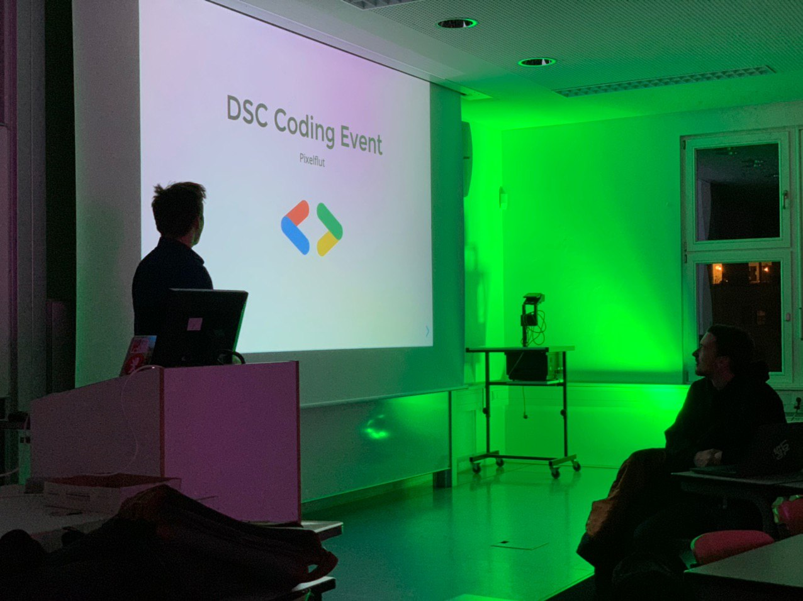
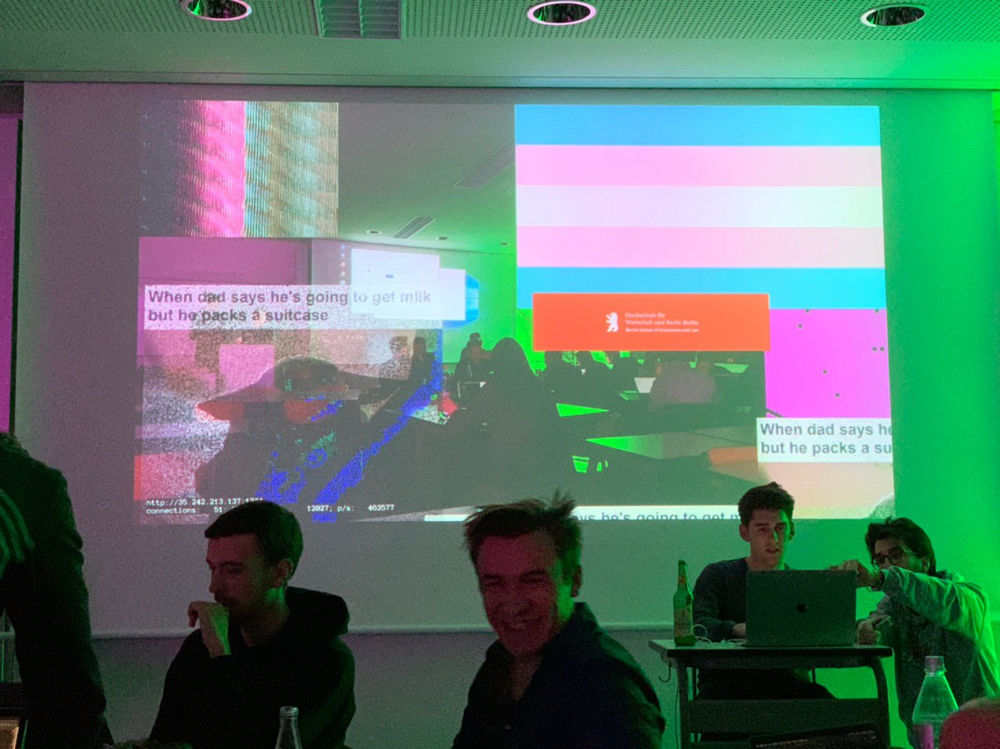
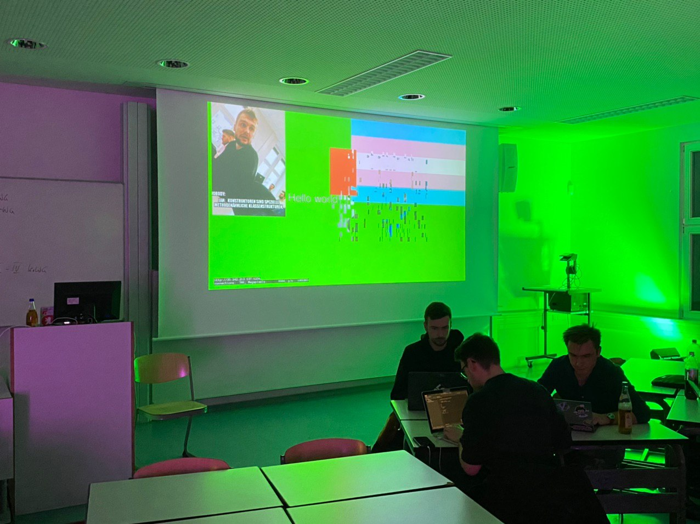

After our first [Pixelflut event](/events/tu-hackday) at the TU Berlin with a
packed room, we knew that playing Pixelflut only once was not enough.

Bringing DSC to the Berlin School of Economics and Law (HWR) we planned for a
cozier event with a small group of people. While packing rooms feels good as
organizers, the smaller scale allowed us to interact and guide our participants
to a much greater degree.

Following a standard introduction to our organization and a presentation on the
technicalities of Pixelflut, we let the students free to find their own ways to
express themselves on the shared canvas.

Having a better ratio of experienced members and guiding mentors, we were able
to let every person to decide to work either on their own ideas or cooperate
with each other to create interesting results.

Similar to the last event, we soon had a multitude of geometric shapes and
images on the board. People started to realize the difficulties did not only lie
in hacking through the TCP protocol, but actually utilizing the limited
bandwidth to achieve visually awesome results.

If this recap has peaked your interest in participating in future DSC events
feel free to join our [Telegram Channel](https://t.me/dsc_berlin), where you will be kept up-to-date on the
latest DSC events in Berlin!
