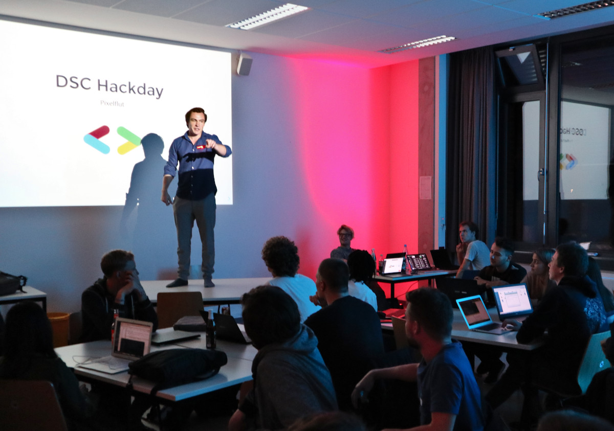
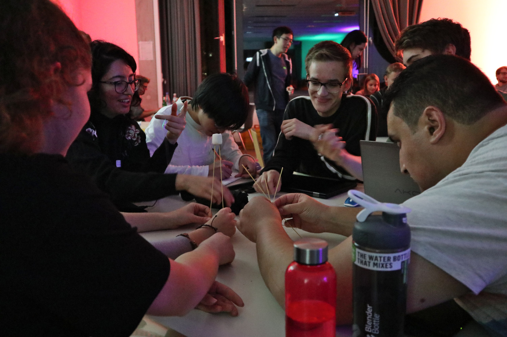
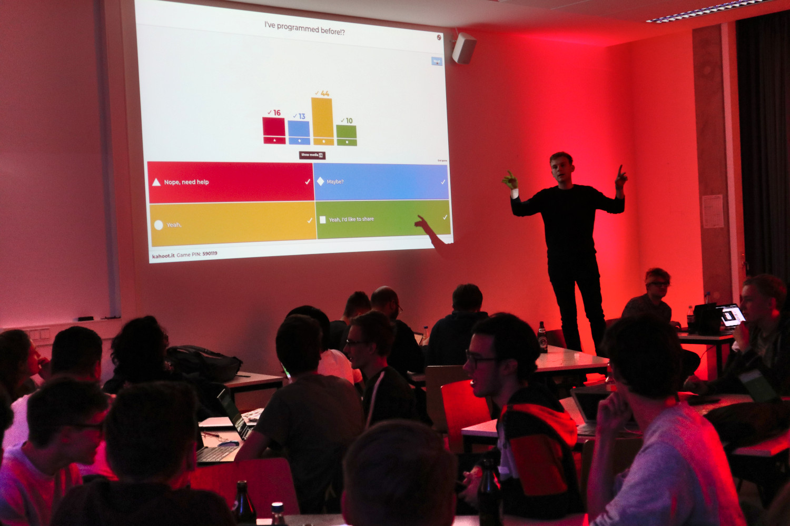
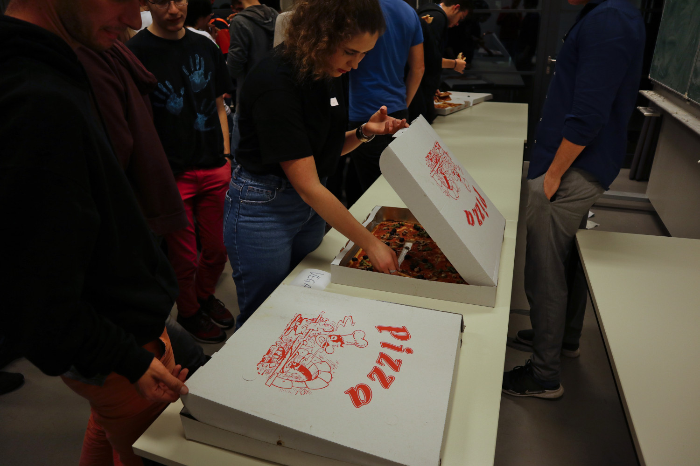
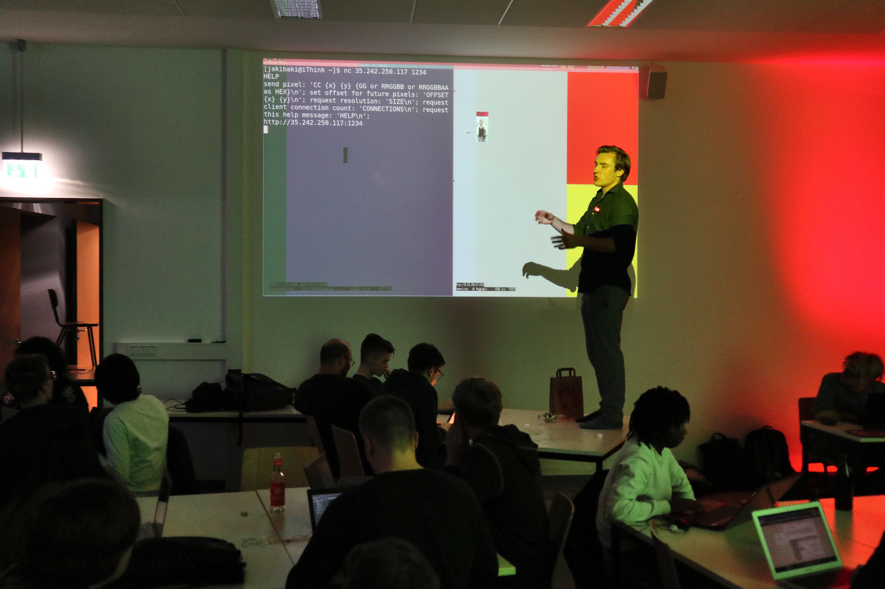
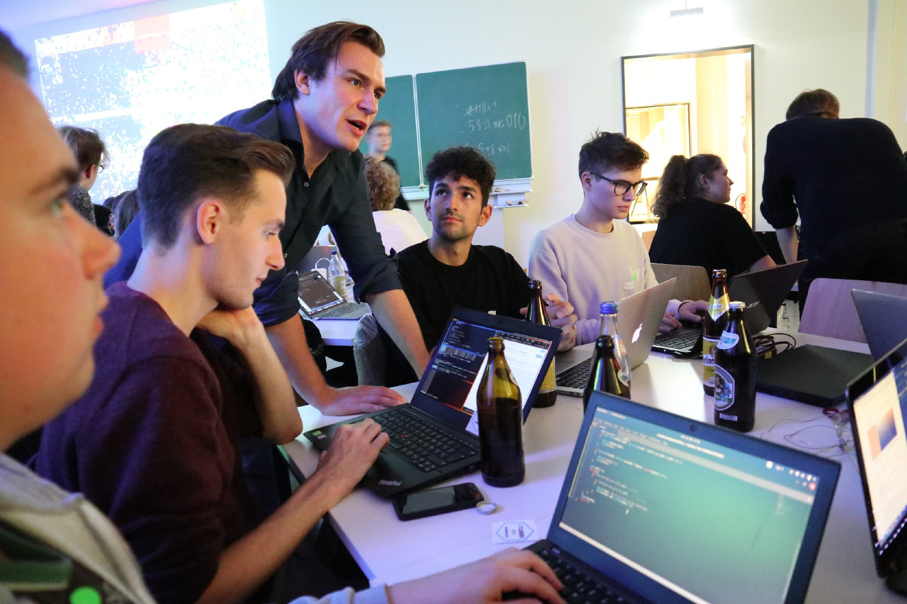
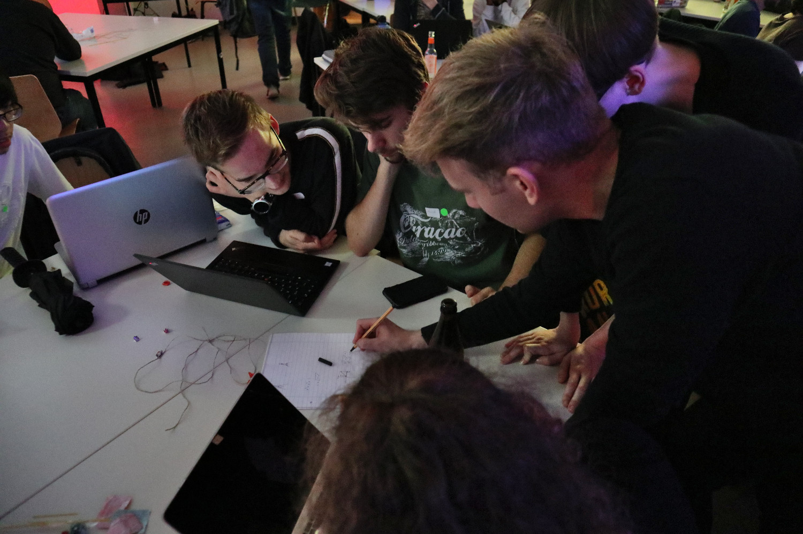
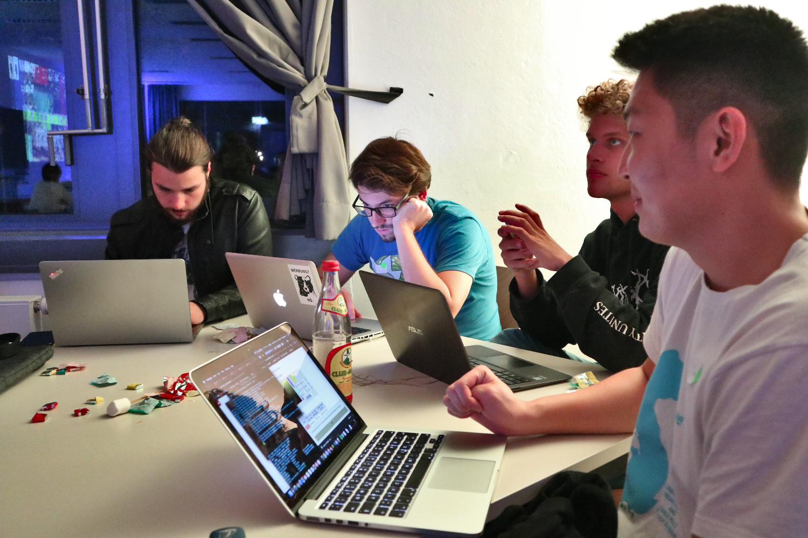
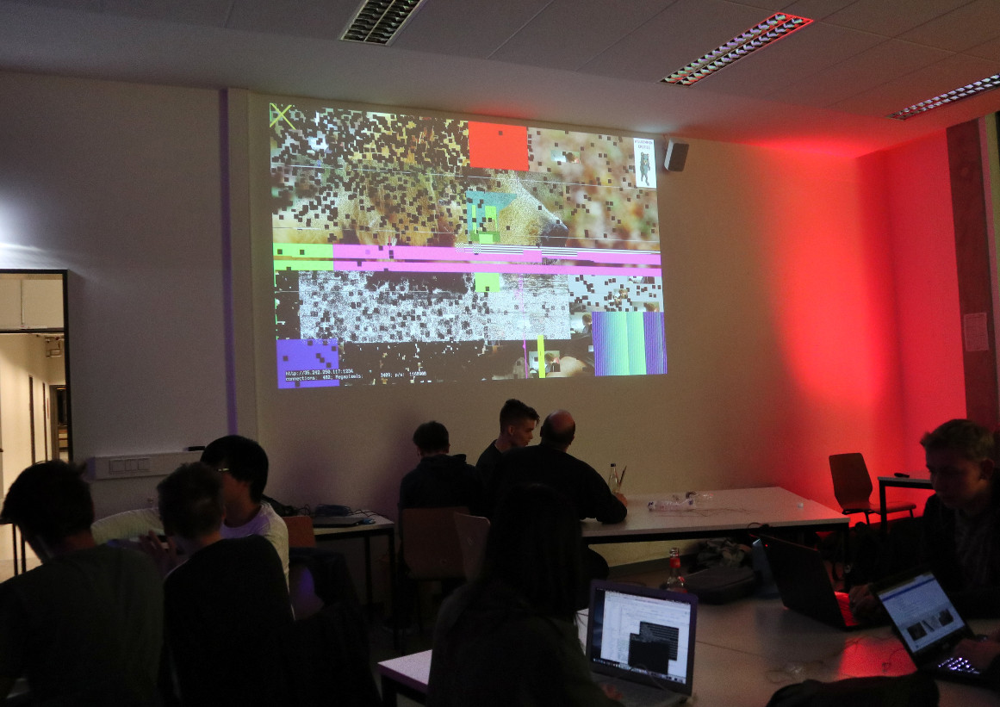

We were super excited to welcome almost a 100 students joining us for the
Pixelflut event.

We started off explaining what would happen in the event and what exactly the
Developer Student Club were planning to do with the students.

With a 100 reservations and plenty of additional people arriving at the venue
without registrations, we had a packed room of people, but still managed to get
everyone a place at a table. People were seated in groups of 8, which would
later become the teams for the main event.

In order to introduce the team members to each other, we started the groups with
a small ice-breaker letting the groups build the highest marshmallow tower with
exactly 6 noodles, half a meter of tape and yarn and a single marshmallow.
Soon a vast variety of construction designs were well underway. With some groups
not only focusing on achieving the highest tower, we also rewarded the most
creative design with the remaining spaghetti noodles.

Using a tool familiar to TU students from their lectures, we conducted a small
survey on the programming experience of the crowd, their favorite programming
languages and what events they would be most interested in.

As we concluded our survey, the pizza for our hungry attendees arrived. With the
ordered 30 pizzas (almost 8 m²) no one remained hungry and no pizza was left at
the end of the day.

With the introductions and the pizza finished, we finally went on to the main
event of the night, Pixelflut!

We first explained the basic idea of the event to all attendees. We hosted a
server which provided a screen showing a large blank screen. The server accepted
a simple protocol to set the color value for single pixels.

After showing a simple example written in python to set the color of the screen
to a certain color. The what and how we left open to the creativity of the
attendees.

Soon the students started adapting our examples, using alternative languages and
attempted to get simple geometric shapes and colors onto the screen.

We took care to ensure that at least some person in a team would have had some
previous programming experience. But while some people might be able to hack
away instantaneously, we supported all students at whatever stage they might
have been. Be it installing the necessary IDEs and tools for writing programs
or understanding the first lines of code they might ever have needed to modify.
But the groups soon found ways to combine their individual skill sets.

The realization came afterwards, that the simplicity of the task and the
protocol might be a bit deceiving. Since all attendees were drawing to the same
shared canvas, performance is key to getting their own pictures shown on the
screen.

After these initial hurdles were overcome, groups soon started to expand upon
the basics and began to draw various images, videos and one group even streamed
their webcam to the canvas.

The final results were entertaining to watch, as ever more sophisticated
implementations battled for the remaining screen estate.
After almost 3 hours of hacking, we closed up with some groups still eagerly
attempting to introduce greater performance and features.

If you had fun at the event or would like to join in on the fun at the next one,
please join our low-frequency [Telegram Channel](https://t.me/dsc_berlin) where
we keep you updated about the latest and greatest DSC Berlin events!
